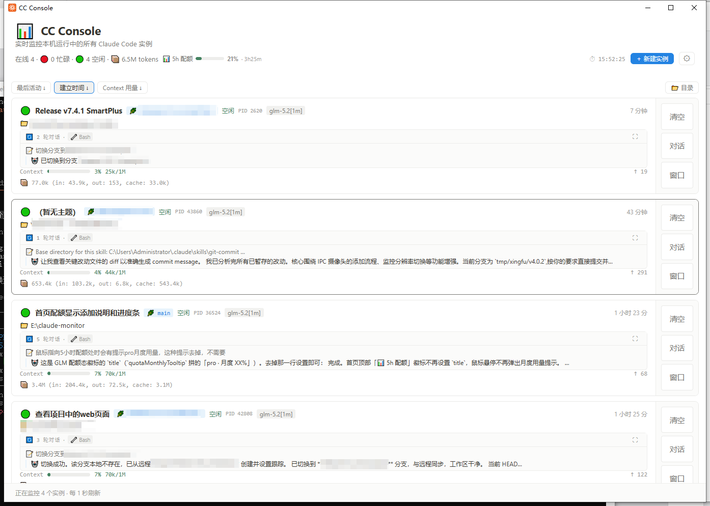
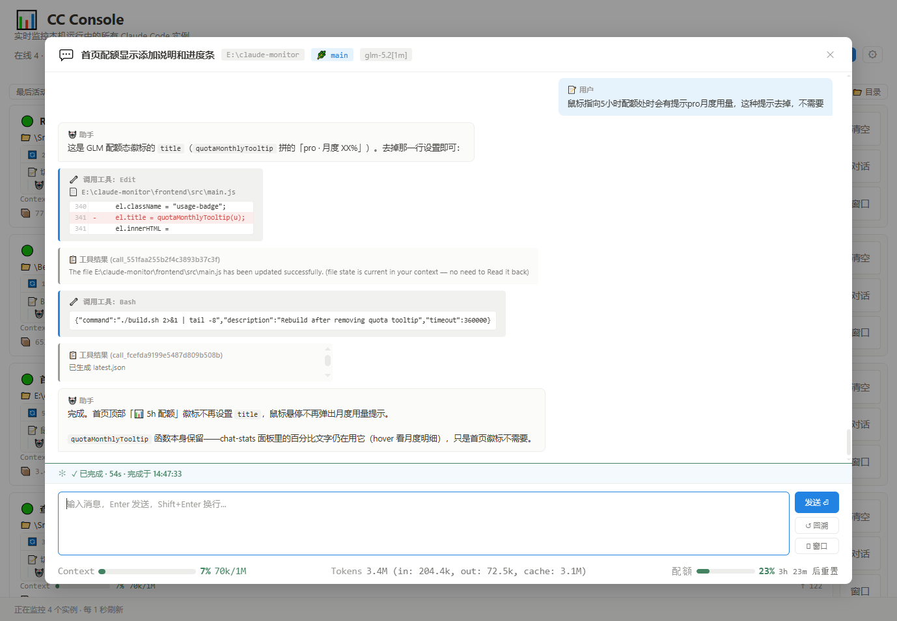
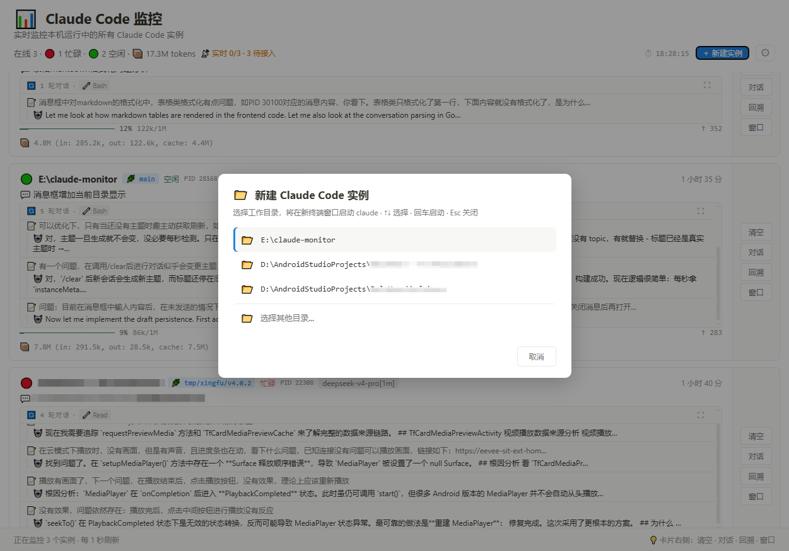

# CC Console

**用图形界面替代 PowerShell / 终端来驱动 Claude Code。** 把「开一堆终端窗口、来回切换、手敲命令」变成一个窗口——在这里管理所有运行中的实例、直接发消息对话、实时查看账号用量与余额。

系统托盘常驻，每秒刷新，跟随系统明暗主题。



---

## 它替你做了什么

日常用 Claude Code，多半是在 PowerShell / Windows Terminal 里手敲：开几个会话就得切几个窗口，看不到全局，看不到这次对话烧了多少 token、账号余额还剩多少，Claude 弹个选项还得回到终端里按上下键选。CC Console 把这些统统搬进一个 GUI：

- **不用切终端**——在一个列表里看清所有实例，点开就能对话
- **不用回终端选选项**——Claude 提问时直接在界面上点按钮
- **不用算账**——账号配额 / 余额实时显示在首页顶部

---

## ✨ 核心功能

### 💬 在 GUI 里直接对话（消息发送）

点击任意实例卡片的「对话」按钮打开聊天面板，像聊天软件一样和这个 Claude Code 实例交流：

- **发送消息**：底部输入框直接输入，`Enter` 发送、`Shift+Enter` 换行；支持多行、草稿自动保存、`↑/↓` 调出历史消息、斜杠命令（`/`）自动补全
- **完整对话流**：用户消息、助手回复、工具调用与结果（Edit 的 diff、Markdown 渲染、消息时间戳）一目了然
- **Claude 提问直接点选**：当 Claude 用 `AskUserQuestion` 抛出选项时，面板里直接渲染成按钮，点一下就把选择发给实例——多问逐题导航、带说明文字、支持多选，**完全不用切回终端按上下键**
- **Plan 模式 / 权限请求**：同样在面板里一键应答
- **回溯**：打开 Claude 的回溯选择器并自动把终端置前
- **底部信息条**：Context 胶囊进度条、本轮 / 累计 tokens、会话费用与时长、5 小时配额进度 + 重置倒计时



### 🏠 主页：全局监控 + 账号用量

主页一眼看清全局，并在顶部直接显示当前账号的**用量 / 余额**：

- **顶部用量徽标**：按你 Claude Code 的后端自动切换——
  - **GLM（z.ai / 智谱）**：显示 `📊 5h 配额` + 进度条 + 百分比 + 重置倒计时，接近上限自动变橙 / 红
  - **DeepSeek**：显示 `💰 余额 ¥X`
- **全局统计**：在线数、忙碌 / 空闲计数、累计 Context tokens、残留会话数
- **实例卡片**：状态灯（忙碌时脉冲呼吸）、工作目录、模型、运行时长、对话主题、**Context 用量进度条**（绿 / 黄 / 红分级）、本轮输出与累计 token 明细

### 🚀 一键启动新实例

从监控器直接在新的终端窗口拉起 Claude Code：手动选目录，或从最近使用目录一键启动；终端窗口可设为显示 / 隐藏。



---

## 其他功能

- **卡片快捷操作**：`清空`（发 `/clear`）、`窗口`（把实例终端置前）
- **排序与筛选**：按最后活动 / 建立时间 / Context 用量排序；按工作目录筛选
- **版本更新**：内置更新检查，自动下载安装包并校验 minisign 签名后替换
- **系统托盘**：关闭窗口隐藏到托盘常驻；单实例（重复启动激活已有窗口）
- **明暗主题**：跟随系统，Notion 风格
- **命令行模式**：`cc-console.exe --list` 打印一次实例表格后退出，适合脚本
- **开机启动**：设置面板一键开关

> 📖 细节可参考 [docs/功能介绍.md](docs/功能介绍.md)（部分内容为早期版本）

---

## 安装

### 安装包（推荐）

从 [GitHub Releases](https://github.com/pie-tk/cc-console/releases) 下载 `cc-console-setup.exe`，双击安装。支持中文（简体/繁体），自动创建桌面快捷方式。

### 便携版

从 [Releases](https://github.com/pie-tk/cc-console/releases) 下载 `cc-console.exe`，直接运行。

> 环境要求：**Windows 10/11**（WebView2 系统自带）+ **Claude Code CLI** 已安装

---

## 使用

```bash
# GUI 模式（托盘常驻，每秒刷新）
cc-console.exe

# 命令行模式（打印一次后退出）
cc-console.exe --list
```

`--list` 输出示例：

```
在线 Claude Code 实例: 3   (● 忙碌 1   ○ 空闲 2)

PID      状态        模型            Context           本轮   对话主题                     项目 (工作目录)
43920    ● 忙碌      glm-5.1        26% 52k/200k      105    Build app to monitor Clau…   E:\test
22912    ○ 空闲      glm-5.1        13% 27k/200k      55     Update Claude Code version   C:\Users\Administrator
41832    ○ 空闲      （新）          （新）            （新） （新会话·无消息）             ...\BelaHome\belahome
```

---

## 配置

### 自定义模型上下文上限

内置 60+ 模型的上下文上限表。如果你的模型与默认不同，在 `~/.cc-console.json` 覆盖：

```json
{ "modelLimits": { "glm-5.1": 256000 } }
```

### 应用设置

GUI 设置面板（⚙）可配置：关闭按钮行为、开机启动、终端窗口模式、消息发送键。

---

## 构建

```bash
git clone git@github.com:pie-tk/cc-console.git
cd cc-console

# 一键构建（exe + 安装包）
./build.sh

# 或分步：
cd frontend && npm install && npm run build && cd ..
go build -ldflags="-H windowsgui -s -w" -o cc-console.exe .
```

> 依赖 Go 1.26+、Node.js。国内网络设 `go env -w GOPROXY=https://goproxy.cn,direct`

---

## License

[MIT](LICENSE)
